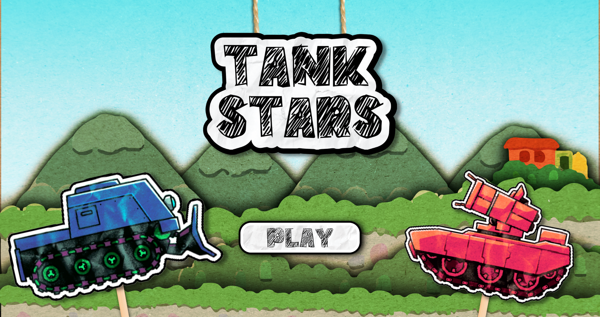
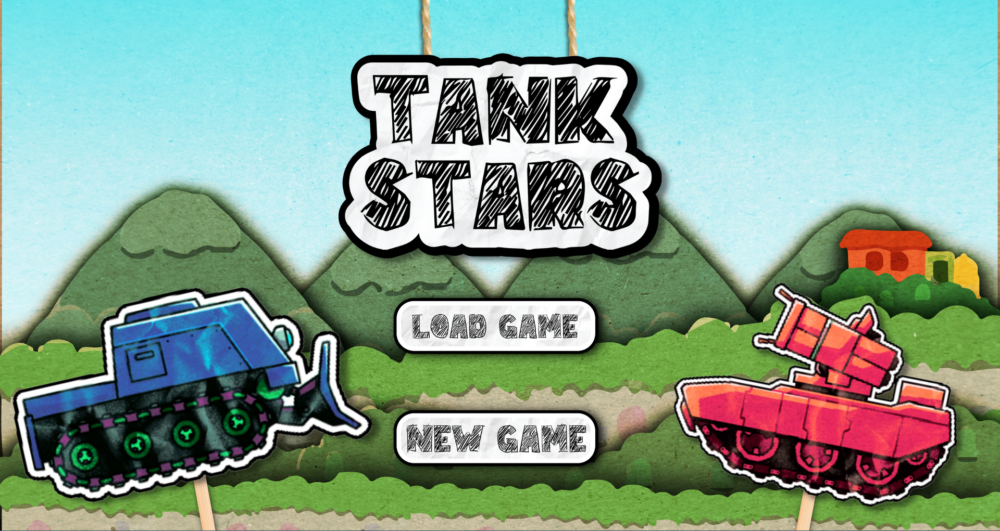
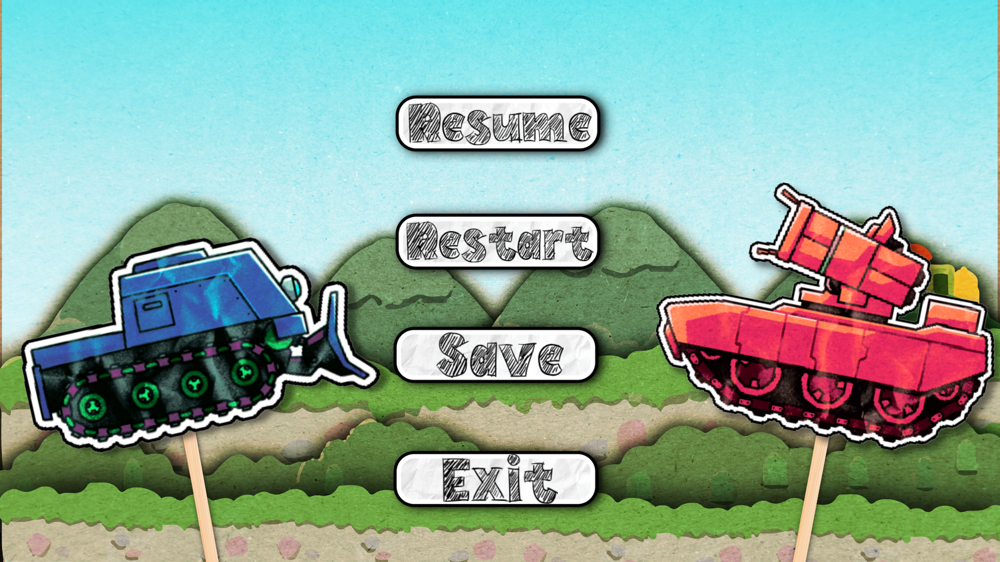
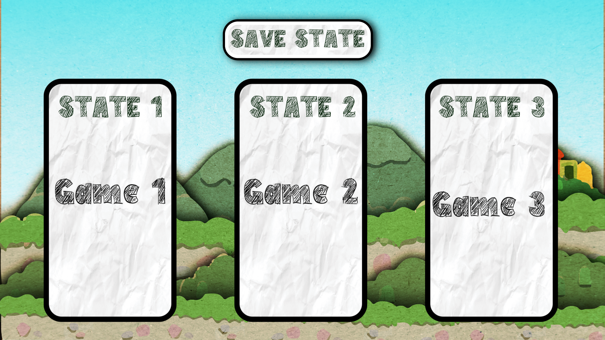
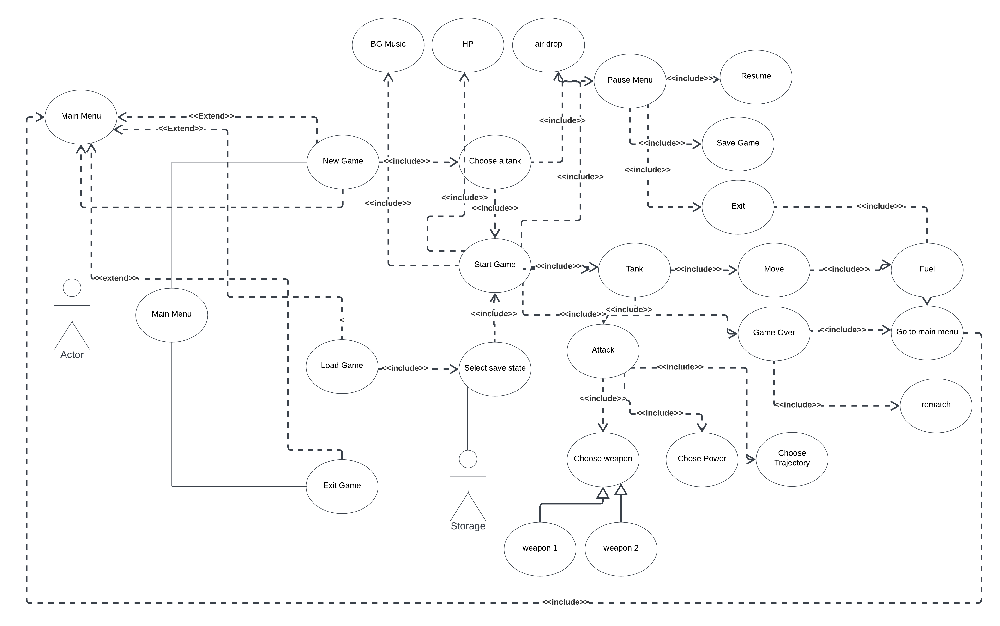

# TankStars 

This project is a clone of the popular game "TankStars" implemented in Java using the LibGDX framework.

## Overview

TankStars is a turn-based artillery game where players control tanks and engage in battles. The objective is to strategically aim and fire projectiles at opponents to eliminate their tanks while protecting your own.

## Features

- Player vs. Player (PvP) gameplay.
- Dynamic sound effects and visual effects.
- win/loss conditions.
- Save game/Load game
- Air drops
  
## Controls

- Use arrow keys to move the tanks.
- Use 1 to fire for player 1
- Use 2 to fire for player 2
  
## Gameplay


## Screenshots









## Prerequisites

To run the game, you need to have the following installed:

- Java Development Kit (JDK) version 8 or above.
- Gradle build tool.

## Getting Started

To get started with the TankStars clone, follow these steps:

1. Clone the repository:

   ```
   git clone https://github.com/yourusername/tankstars-clone.git
   ```

2. Navigate to the project directory:

   ```
   cd tankstars-clone
   ```

3. Run the game:
Open the project in your preferred Java IDE (e.g., IntelliJ IDEA, Eclipse) and run the DesktopLauncher.java file located in **desktop/src/com/mygdx/game/**.

Alternatively, you can run the game from the command line using Gradle. In the project root directory, execute the following command:
```
./gradlew desktop:run
```
4. Play the game and enjoy the TankStars clone!


## UML Diagram


## Acknowledgments

- The TankStars game, which inspired this clone.
- The LibGDX framework and its community for providing the tools and resources.
